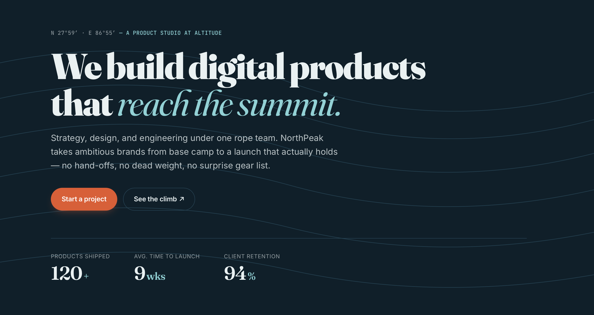
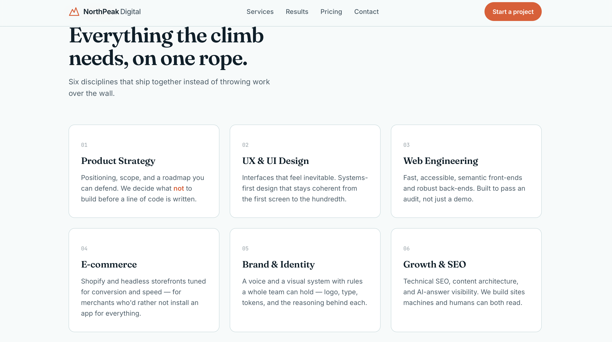
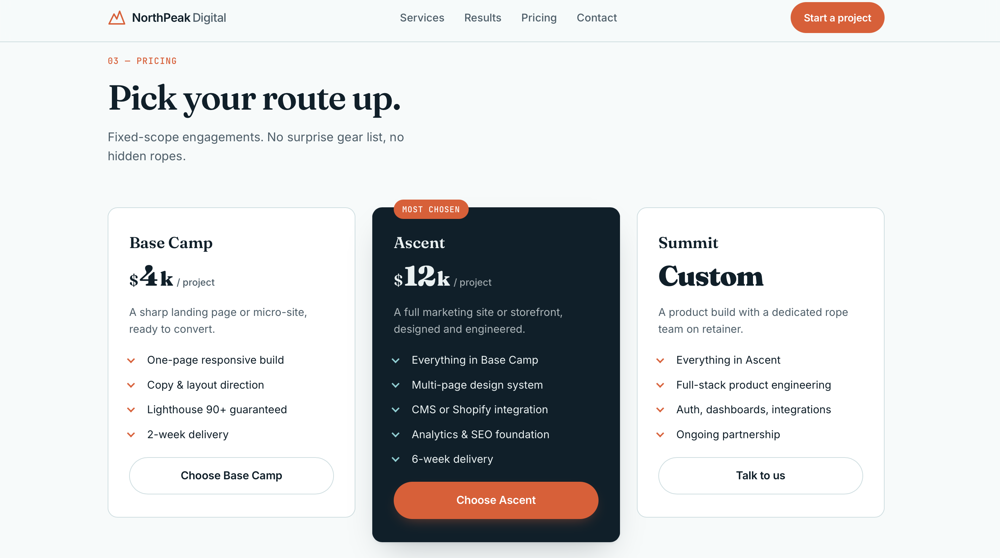

<div align="center">

# NorthPeak Digital

### Editorial-Inspired Digital Product Studio

*A premium one-page digital agency website built with HTML5, CSS3, and Vanilla JavaScript.*


🌐 **Live Demo**  
https://northpeak-digital-sriya.netlify.app/

</div>

---

## Overview

NorthPeak Digital is a fictional product studio website designed to showcase a modern, editorial-inspired approach to digital agency design.

Built around bold typography, generous whitespace, and a clean visual hierarchy, the website highlights the agency's services, measurable client results, pricing plans, and project inquiry workflow while delivering a responsive, accessible, and performance-focused user experience.

---

## Highlights

- Editorial-inspired responsive layout
- Premium typography and visual hierarchy
- Six-service showcase
- Results and testimonials section
- Three-tier pricing plans
- Project inquiry form with client-side validation
- Smooth scrolling navigation
- Mobile-first responsive design
- Semantic HTML
- Accessibility-focused structure
- Performance-optimized front end

---

## Tech Stack

- HTML5
- CSS3
- Vanilla JavaScript
- Google Fonts
- Netlify

---

## Design Philosophy

NorthPeak Digital was designed around three core principles:

- **Clarity** — clean layouts with a strong visual hierarchy.
- **Performance** — lightweight assets and efficient front-end code.
- **Craft** — thoughtful typography, spacing, and consistency to create a premium editorial experience.

---

## Performance

The project was optimized with a focus on:

- Responsive layouts
- Semantic HTML
- Accessible navigation
- Efficient CSS organization
- Optimized assets
- Lighthouse-friendly practices

---

## Project Structure

```text
NorthPeak-Digital/
│
├── index.html
├── style.css
├── script.js
├── assets/
└── README.md
```

---

## Project Preview

A preview of the responsive landing page built for the Digital Heroes Web Development assessment.

### Hero Section

<p align="center">
  
</p>

### Services

<p align="center">
  
</p>

### Pricing

<p align="center">
  
</p>

---

## Running Locally

Clone the repository:

```bash
git clone https://github.com/Sriyamalhar/northpeak-digital.git
```

Navigate to the project folder:

```bash
cd northPeak-Digital
```

Open `index.html` in your preferred browser.

No build tools or additional dependencies are required.

---

## AI Usage

ChatGPT was used selectively to brainstorm content structure, review semantic HTML, suggest responsive layout refinements, and improve the project documentation. All implementation, styling, responsiveness, debugging, testing, optimization, and final code were completed manually.

---

## TASK B- Optimization
## Lighthouse Audit Report
The website was optimized to achieve a Lighthouse score of 90+ in both Performance and Accessibility.

<p align="center">
  
</p>

## Changelog
The detailed optimization changes and their impact are documented in the file:

[View Optimization Changelog](./CHANGELOG.md)

### Loom Walkthrough

[View Loom Walkthrough](https://www.loom.com/share/a1bf4fd40f3a4050b55a9662ebb7336d)
  
## Assessment

This project was created for the **Digital Heroes Internship Qualification Task** for the Web Development role.

---

## Author

**Sriya Malhar**

🌐 **Live Demo**  
https://northpeak-digital-sriya.netlify.app/

💻 **GitHub**  
https://github.com/Sriyamalhar

💼 **LinkedIn**  
https://www.linkedin.com/in/sriya-malhar-55682b388/
